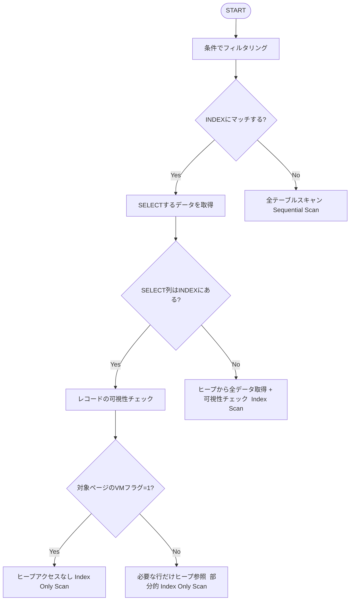

```mermaid
flowchart TD
    START([START])
    A1[条件でフィルタリング]
    A2{INDEXにマッチする?}
    B1[SELECTするデータを取得]
    B2{SELECT列はINDEXにある?}
    C1[レコードの可視性チェック]
    C2{対象ページのVMフラグ=1?}
    INDEX_ONLY_Y[ヒープアクセスなし Index Only Scan]
    INDEX_ONLY_N[必要な行だけヒープ参照  部分的 Index Only Scan ]
    INDEX_SCAN[ヒープから全データ取得 + 可視性チェック  Index Scan ]
    SEQ_SCAN[全テーブルスキャン  Sequential Scan ]

    START --> A1 --> A2
    A2 -- Yes --> B1 --> B2
    B2 -- Yes --> C1 --> C2
    C2 -- Yes --> INDEX_ONLY_Y
    C2 -- No --> INDEX_ONLY_N
    B2 -- No --> INDEX_SCAN
    A2 -- No --> SEQ_SCAN
```
